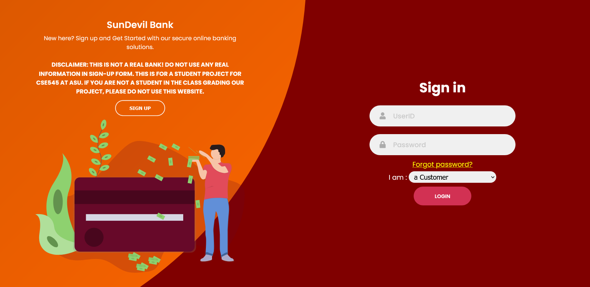
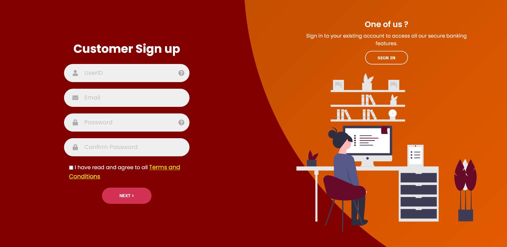
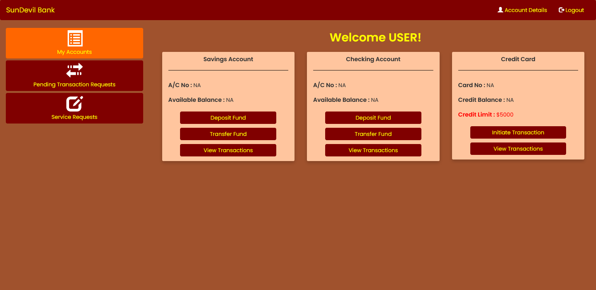
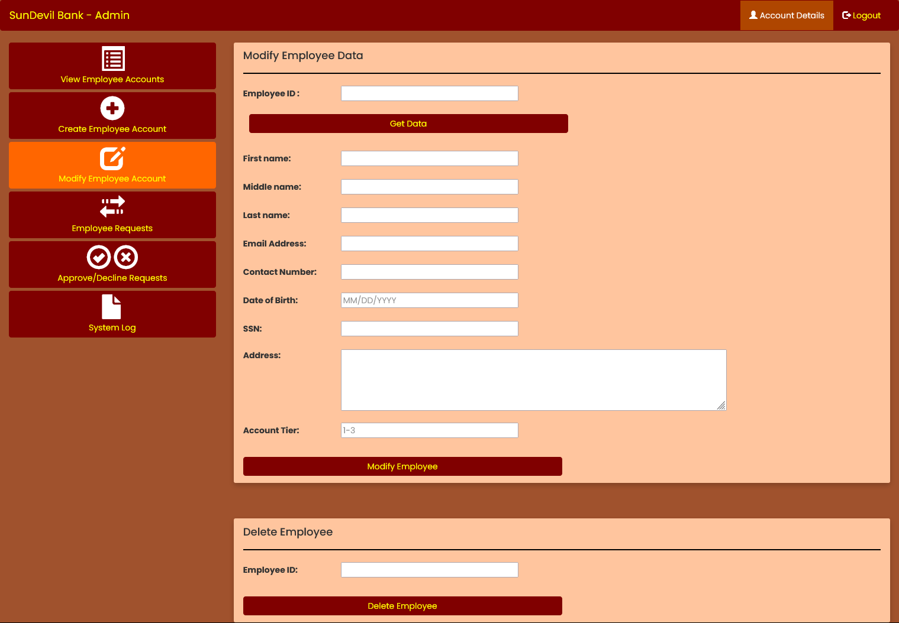

## Secure Banking Web Application

This is a full stack security-focused banking web application built as part of the course project for Software Security. This project primarily focuses on implementing security features for the banking functionalities and normal web practices and was to be tested by our peers for potential security breaches. I was the leader for this group project and managed a team of 5 people over 4 months with a fully online synchronized and agile working culture to complete this project. Ours was one of the most modern, robust and secure websites among all the others.

### Features

-   OTP authentication
-   Data masking ,hashing and encryption
-   Spam protection
-   Hyperledger for transactions
-   Session management and Access Control
-   Code obfuscation
-   Public Key Certification
-   Chatbot

### Technologies

-   
-   
-   
-   
-   
-   

### How to run

`N.B. The mysql connector details has been erased` 

-   Install python and all the other requird libraries in 'requirements.txt' in your local system
-   run flask to boot the server
-   open login.html as your homepage in a simple http server for your client.

### Preview

  
  
  

### Support Development
 

